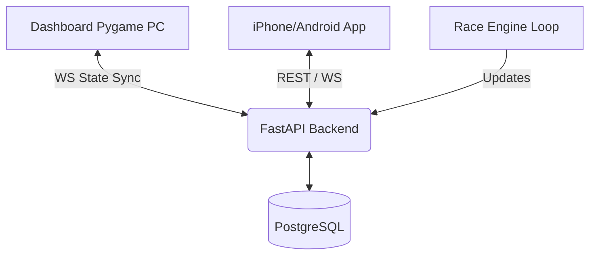

# Jackpot Jockeys Backend 🏎️💨

Este es el backend autoritativo de **Jackpot Jockeys (AntiGravity)**, un casino de carreras futuristas donde la velocidad y el caos se encuentran. El servidor gestiona el estado de las carreras, las apuestas en tiempo real, la economía de los usuarios y la sincronización con los dashboards de Pygame.

## Overview
Jackpot Jockeys es una experiencia LAN-first (con miras a online) diseñada para entornos competitivos.
- **Autoritativo**: El servidor dicta el estado de la carrera y resuelve apuestas de forma centralizada.
- **Tiempo Real**: Comunicación bidireccional vía WebSockets para sincronización de milisegundos.
- **Economía Robusta**: Manejo de balances (total vs. bloqueado) con garantías transaccionales.

## Why this Stack?
Elegimos estas herramientas por su rendimiento, seguridad y facilidad de desarrollo:

- **FastAPI**: 
  - *High performance*: Basado en Starlette y Pydantic, ideal para aplicaciones asíncronas.
  - *Auto-documentation*: Swagger UI integrada (`/docs`) para prototipado rápido.
- **PostgreSQL**: Base de datos relacional robusta con soporte para transacciones ACID.
- **SQLAlchemy 2.0**: El ORM estándar de Python, ahora con mejor soporte para tipos y API moderna.
- **Alembic**: Gestión de migraciones para versionar el esquema de la base de datos de forma segura.
- **WebSockets**: Crucial para el "State Sync" entre el motor de la carrera y los clientes (Pygame/Móvil).

## Architecture
El servidor actúa como el orquestador central:



### Decisiones de Diseño
- **Server Authoritative**: Todo cálculo de balance, costo de poderes y premios ocurre en el backend. Los clientes solo visualizan y envían intenciones.
- **Atomicidad (SELECT FOR UPDATE)**: Las operaciones de billetera (wallet) bloquean la fila en la DB para prevenir *race conditions* durante apuestas simultáneas.
- **Idempotencia**: Los endpoints críticos aceptan un `X-Idempotency-Key` para evitar cargos dobles por reintentos de red.
- **WS State Versioning**: Cada snapshot de WebSocket incluye una `state_version` para que los clientes puedan detectar si perdieron paquetes y deben resincronizar.

## Getting Started (Docker)

La forma más rápida de correr el backend es usando Docker Compose:

1. **Configura el entorno**:
   ```bash
   cp .env.example .env
   # Edita .env si es necesario
   ```

2. **Lanza los servicios**:
   ```bash
   docker-compose up --build
   ```
   Esto levantará el backend en `http://localhost:8000` y una instancia de Postgres.

## Migraciones (Alembic)
El esquema evoluciona con el proyecto. Para aplicar cambios:

- **Aplicar migraciones**:
  ```bash
  docker-compose exec app alembic upgrade head
  ```
- **Crear nueva migración**:
  ```bash
  docker-compose exec app alembic revision --autogenerate -m "descripción"
  ```

## Testing
Contamos con una suite de pruebas enfocada en la integridad económica y la concurrencia:

```bash
./run_tests.sh
```
**¿Qué validamos?**
- **Wallet Atomicity**: Pruebas de estrés que intentan gastar más del balance disponible simultáneamente.
- **Idempotency**: Verificar que enviar la misma apuesta dos veces no duplica el cargo.
- **Cancel Fee**: Asegurar que la penalización por cancelación se calcule y deduzca correctamente.
- **State Machine**: Transiciones legales de la carrera (Lobby -> Betting -> Racing).

## Configuration
Configuración principal vía `.env`:
- `MAX_POWER_SPEND_PER_RACE`: Limita el caos en la pista.
- `POWER_COST_SCALING`: Factor multiplicativo para el costo de poderes sucesivos.
- `CANCEL_FEE`: Porcentaje de cobro por arrepentirse de una apuesta.

## Roadmap
- [ ] **Extra Markets**: Soporte para apuestas tipo *Trifecta* y *Exacta*.
- [ ] **Contracts/Loans**: Sistema de préstamos cuando un jugador queda en quiebra.
- [ ] **Observabilidad**: Integración con Prometheus/Grafana para monitorear latencia de WS.
- [ ] **Cloud Ready**: Preparar despliegue automático en Google Cloud Run.
